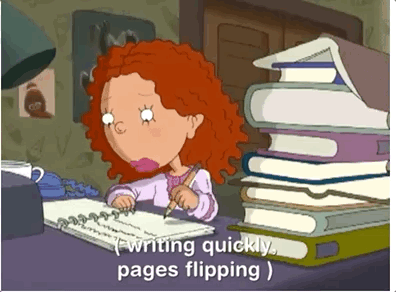

# Yzma's potion Machine

Inspired one of my favorite childhood movies, the object of this game is to have all the matching potions to help Yzma kick Kuzsco off the throne. 
To begin all you have to do is press the play button, and to play again just click the try again button to reset the game.

This game was built using Css, Javascript, and HTML

Being that this was my first ever project I began with writing out psuedo code, to help me have an idea of which functions to write.

Game Link 

In the future, I plan to add transitions that would add images depending on if the player won or lost, I want to add a story line, and maybe audio. 